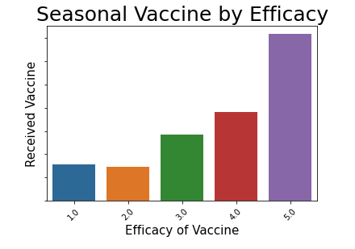

# Vaccination Model:  Seasonal Flu Vaccine

## Project Overview

This project uses phone survey data from 2009-2010 to build a machine learning model that helps a non-profit firm understand how peoples backgrounds, opinions, and health behaviors are related to their personal vaccination patterns.

## Business Problem

As COVID-19 continues to coincide with every day life, it is important to continue to educate about the positive effects of vaccinations.  As the push for vaccinations continues, it is important to remind the public of the seasonal flu vaccine.  In an effort to push for higher vaccination rate for the seasonal flu vaccine, a local non-profit is looking to understand how peoples backgrounds, opinions, and health behaviors are related to their personal vaccination patterns.  This will provide the necessary guidance for public health efforts as flu season approaches.

## The Data

In late 2009 and early 2010, the United States conducted the National 2009 H1N1 Flu Survey.  This survey was conducted through the phone and asked respondents if they had received the H1N1 and seasonal flu vaccines.  They were also asked questions about themselves.  The additional questions were to see their social, economic, and demographic background as well as opinion based questions.  The opinion based questions focused on risks of illness and vaccine effectiveness, and behaviors toward mitigating transmission.

To better utilize the data, this project focuses on just how the respondants answered the questions to the seasonal flu vaccine.

## Modeling Process

Four different models were created before choosing best one.  Before the data was modeled it was cleaned, split, and scaled.
Model Types:
* Logistic Regression
* KNN
* Random Forest
* XG Boost

## Conclusion

The model which is best fit for predicting if someone received the seasonal flu vaccine is the logistic regression model. It will accurately predict 78% of the time if someone received the seasonal flu vaccine.

After modeling and EDA, it is the suggestion to the stakeholder to target three specific demographics in education and awareness prior to the next flu season

* Those who do not view the seasonal flu as a risk

* Those whose doctor does not reccomend the vaccine

* Those who do not view the vaccine as effective

* Those who are in the age group of 18-34 years old

## Next Steps

A best fit model was able to be created for the stakeholder by utilizing the the data from the National 2009 H1N1 Flu Survey focusing on the seasonal flu vaccine.  The reccomendation to the stakeholder in their efforts moving forward to target the following demographics in education and awareness prior to the following flu season:

* Those who not view the seasonal flu as a risk
* Those whose doctor does not reccomend the vaccine
* Those who do not view the vaccine as effective
* Those who are in the age group of 18-34 years old.

The stakeholder can also target the following:

* Those who fall below the poverty line
* Those who are currenlty unemployed.

